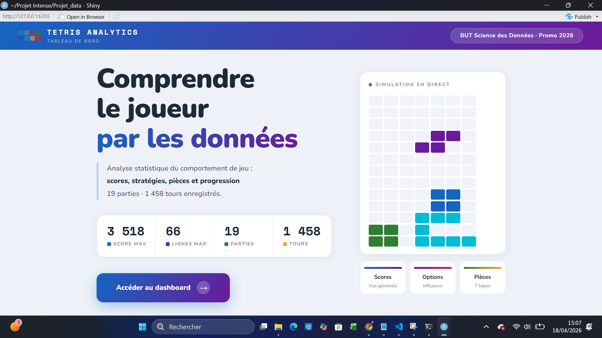
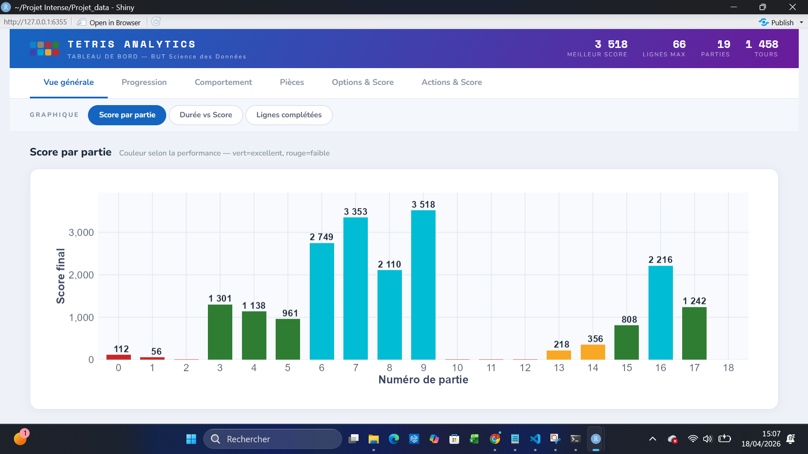
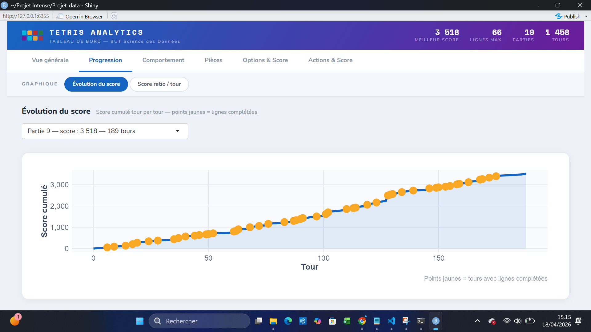

# TETRIS Analytics — Projet Intensif BUT Science des Données

> Projet réalisé en 4 jours · IUT Clermont Auvergne (Aurillac) · Promo 2026  
> Pipeline complet : système embarqué → collecte de données → API REST → dashboard IA

---

## Contexte

Projet intensif de 4 jours impliquant toute la promotion. L'objectif était de construire
un **système de bout en bout** : du jeu Tetris tournant sur Linux embarqué jusqu'à un
tableau de bord analytique avec modèles prédictifs.

Chaque groupe avait une responsabilité dans la chaîne de données :

| Groupe | Rôle |
|--------|------|
| 1 | Jeu Tetris — production des logs de jeu |
| 2 | Stockage des données brutes |
| 3 | Calculs et données transformées |
| 4 | API RESTful (FastAPI / Python) |
| **5 (mon groupe)** | **Interface graphique & modèles prédictifs (R Shiny)** |
| 6 | Coordination inter-équipes |

---

## Architecture globale

```
Tetris (Linux embarqué)
        ↓ logs JSON
Stockage brut (Groupe 2)
        ↓
Calculs & transformation (Groupe 3)
        ↓
Base NoSQL / MongoDB
        ↓
API REST FastAPI (Groupe 4)
        ↓ JSON
Dashboard R Shiny + Prédictions (Groupe 5 — ce dépôt)
```

---

## Jour 1 — Système embarqué & Linux

Avant de se diviser en groupes, toute la promotion a travaillé ensemble sur :

- Configuration d'un environnement **Linux embarqué** (Buildroot / Raspberry Pi)
- Création d'un **package custom** pour le jeu Tetris (`tint`) avec gestion des dépendances ncurses
- Écriture des fichiers `Config.in` et `tint.mk`
- **Lancement collectif du jeu Tetris** et collecte des premiers logs de parties

---

## Mon rôle — Groupe 5 : Interface graphique & Prédictions

### Dashboard R Shiny

Application web interactive construite avec R Shiny, organisée en 6 onglets :

- **Vue générale** — scores par partie, durée vs score, lignes complétées
- **Progression** — évolution du score tour par tour, score ratio
- **Comportement** — analyse des actions du joueur (drops, rotations, inaction)
- **Pièces** — fréquence et performance des 7 tetrominos
- **Options & Score** — influence du niveau d'information sur le score
- **Actions & Score** — impact des rotations avant dépôt sur la performance

Architecture modulaire avec séparation `ui.R` / `server.R` / `api_calls.R` permettant
de basculer entre données mock (CSV) et vraie API REST en changeant une seule variable.

### Modèles prédictifs

4 modèles entraînés sur 57 parties enregistrées (1 458+ tours) :

| Modèle | Objectif | Performance |
|--------|----------|-------------|
| Régression linéaire simple | Prédire le score final | R² = 0.779 / RMSE = 250 pts |
| Régression + comportement | Prédire le score avec actions | R² = 0.855 / RMSE = 203 pts |
| Régression logistique | Bonne ou mauvaise partie ? | Précision = 83.6% |
| Arbre de décision | Règles de décision lisibles | Précision = 81.8% |

**Résultat clé** : l'ajout des variables comportementales (rotations/tour, taux de drop)
améliore le R² de 7.6 points — preuve que le style de jeu influence significativement
le score au-delà du simple nombre de tours.

---

## Stack technique

```
Langage principal   R (Shiny, ggplot2, dplyr, rpart, httr, jsonlite)
API                 FastAPI (Python) — groupe 4
Base de données     MongoDB / NoSQL — groupe 3
Système embarqué    Linux (Buildroot), Raspberry Pi — jour 1
Versioning          Git / GitHub
```

---

## Lancer le dashboard

```r
# Installer les dépendances
install.packages(c("shiny", "ggplot2", "dplyr", "plotly",
                   "httr", "jsonlite", "rpart", "rpart.plot"))

# Lancer l'application
setwd("Visualisation/")
shiny::runApp()
```

L'application démarre en mode démonstration avec les données CSV.
Pour connecter la vraie API, modifier dans `R/api_calls.R` :
```r
USE_MOCK <- FALSE
BASE_URL <- "http://adresse-api:8000"
```

---

## Aperçu

### Page d'accueil


### Vue générale — Scores par partie


### Progression


---

## Ce que ce projet m'a appris

- Concevoir une **architecture de données de bout en bout** en équipe
- Travailler en **système multi-groupes avec des interfaces contractuelles** (API REST)
- Construire un dashboard Shiny **modulaire et connecté à une API**
- Appliquer des **modèles de ML supervisé** (régression, classification, arbre) sur des données réelles
- Gérer l'**incertitude technique** : développer en mock pendant que les autres groupes construisent leur partie

---

*Projet réalisé dans le cadre du BUT Science des Données — IUT Clermont Auvergne, campus d'Aurillac*
